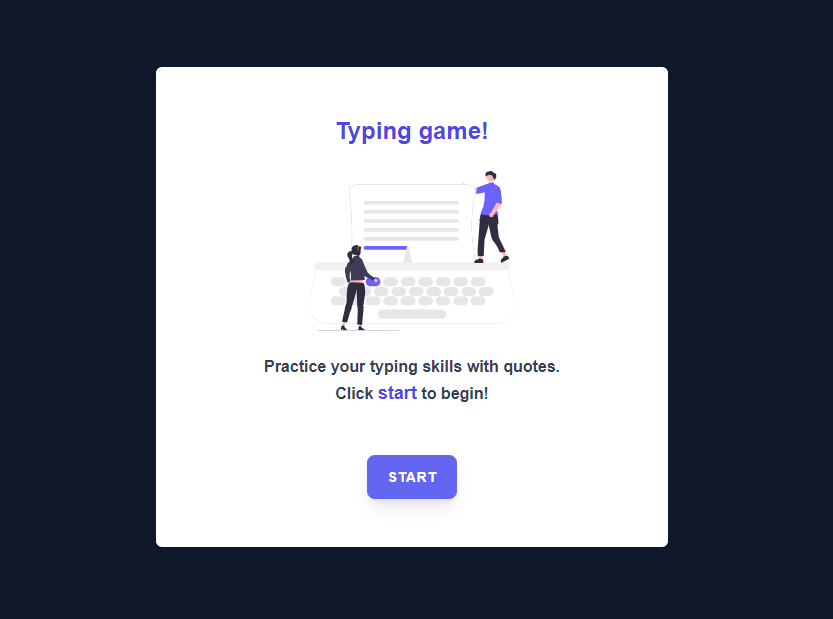

# Typing-Game
### About :

The game is going to test a player's typing skill, which is one of the most underrated skills all developers should have. We should all be practicing our typing! The general flow of the game will look like this:

- Player clicks on start button and is presented with a quote to type
- Player types the quote as quickly as they can in a textbox
    - As each word is completed, the next one is highlighted
    - If the player has a typo, the textbox is updated to red
    - When the player completes the quote, a success message is displayed with the elapsed time

> As the player types, an input event will be raised. This event listener will check to ensure the player is typing the word correctly, and handle the current status of the game.
✔Click on start, and start typing away!
>

### Screenshot :

### Links :

- Live Site URL: [View Live Demo](https://typing-game-teal-eight.vercel.app/)
